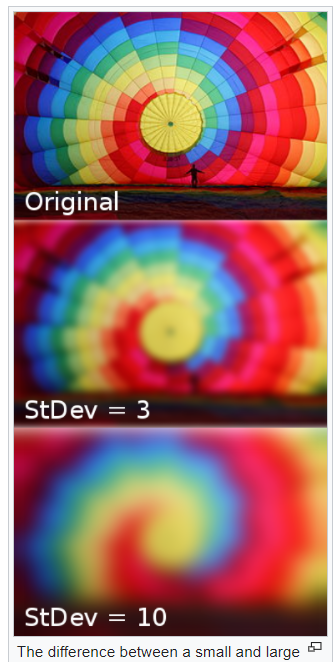

**Gaussian_Filter**

In image processing, a Gaussian filter(also known as Gaussian smoothing or Gaussian blur) is the result of blurring an image by a Gaussian function (named after mathematician and scientist Carl Friedrich Gauss).

It is a widely used effect in graphics software, typically to reduce image noise and reduce detail. The visual effect of this blurring technique is a smooth blur resembling that of viewing the image through a translucent screen, distinctly different from the bokeh effect produced by an out-of-focus lens or the shadow of an object under usual illumination.

Gaussian_Filter is also used as a pre-processing stage in computer vision algorithms in order to enhance image structures at different scales—see scale space representation and scale space implementation.

