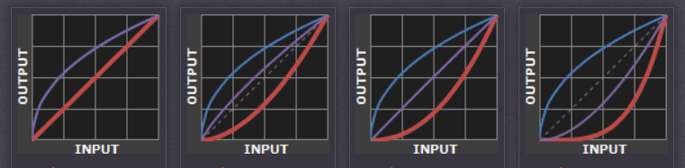

# gamma

This is the gamma that you are controlling when you perform monitor calibration and adjust your contrast setting. Fortunately, the industry has converged on a standard display gamma between "0 to 10" which made images appear brighter relative to a typical PC, but this is no longer the case.

Recall that the display gamma compensates for the image file's gamma, and that the net result of this compensation is the system/overall gamma. For a standard gamma encoded image file (—), changing the display gamma (—) will therefore have the following overall impact (—) on an image:

